# 🚀 Portail Intelligent de Suivi des Projets Clients - SQLI

<div align="center">


**Portail web intelligent pour la gestion collaborative de projets clients**

*Développé pour SQLI Rabat*

[](https://reactjs.org/)
[](https://spring.io/projects/spring-boot)
[](https://www.typescriptlang.org/)
[](https://www.postgresql.org/)
[](LICENSE)

</div>

---

## 📋 Table des Matières

- [🎯 Vue d'ensemble](#-vue-densemble)
- [🖼️ Captures d'écran](#️-captures-décran)
- [🏗️ Architecture](#️-architecture)
- [⚡ Fonctionnalités](#-fonctionnalités)
- [🚀 Installation](#-installation)
- [🔧 Configuration](#-configuration)
- [📱 Scripts de Démarrage](#-scripts-de-démarrage)
- [📊 API Documentation](#-api-documentation)
- [🤝 Contribution](#-contribution)
- [📞 Contact](#-contact)

---

## 🎯 Vue d'ensemble

Le **Portail Intelligent de Suivi des Projets Clients** est une application web moderne développée pour SQLI Rabat et RFC Digital Rabat. Cette plateforme facilite la gestion collaborative de projets en offrant des interfaces dédiées pour chaque rôle : Administrateurs, Chefs de Projet, Développeurs et Clients.

### 🎯 Objectifs
- ✅ **Gestion centralisée** des projets et équipes
- ✅ **Suivi en temps réel** de la progression
- ✅ **Interface intuitive** adaptée à chaque rôle
- ✅ **Sécurité renforcée** avec authentification JWT
- ✅ **Analytics avancées** avec graphiques interactifs
- ✅ **Responsive design** pour tous les appareils

### 👥 Équipe de Développement
- **[Mohamed AZZAM](https://github.com/Azzammoo10)** - Développeur Full Stack


---

## 🖼️ Captures d'écran

### 🔐 Authentification

<div align="center">

#### Page de Connexion
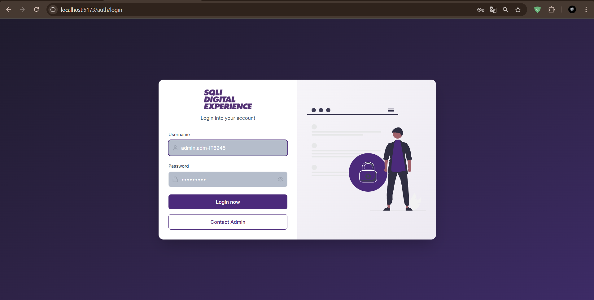

#### Contact Administrateur
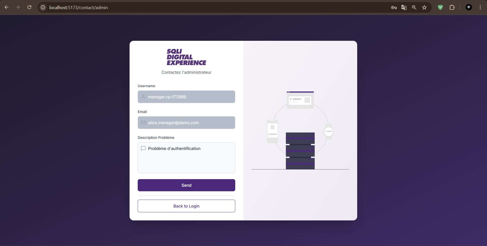

</div>

### 👨‍💼 Dashboard Administrateur

<div align="center">

#### Vue d'ensemble
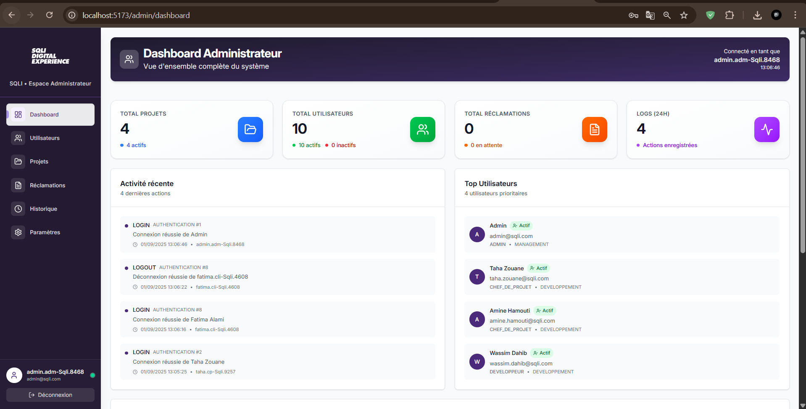

#### Gestion des Utilisateurs
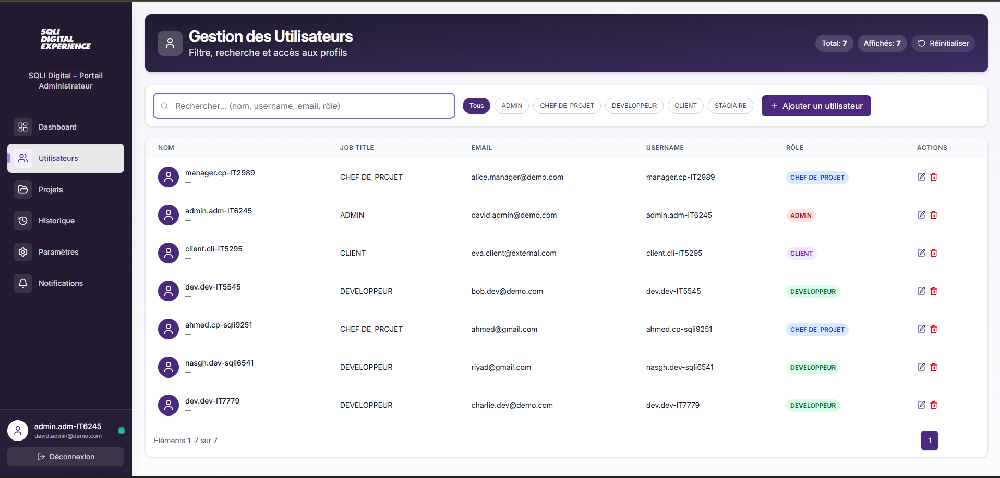

#### Gestion des Projets
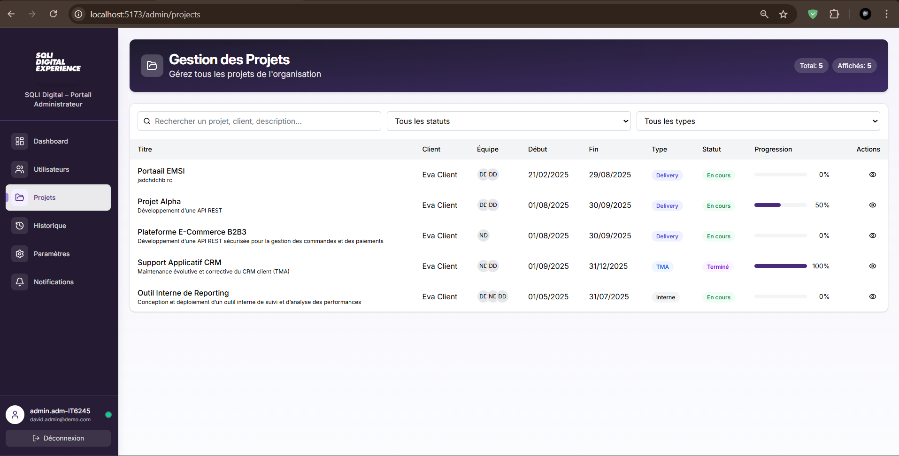

#### Gestion des Réclamations
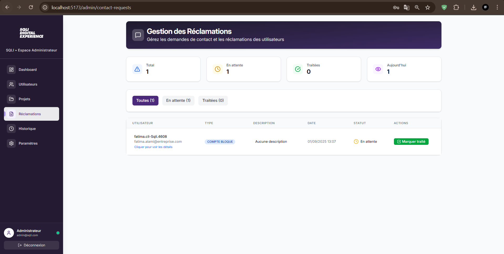

#### Historique des Actions
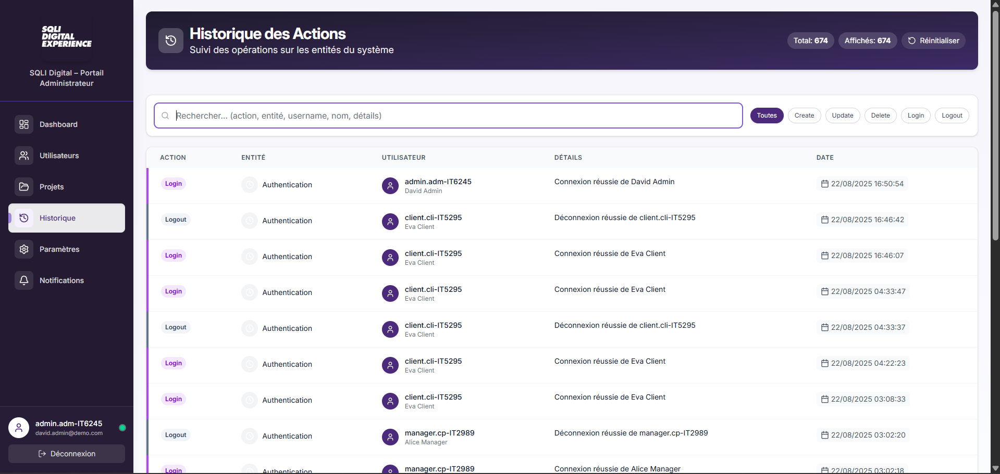

</div>

### 👨‍💻 Dashboard Chef de Projet

<div align="center">

#### Vue d'ensemble
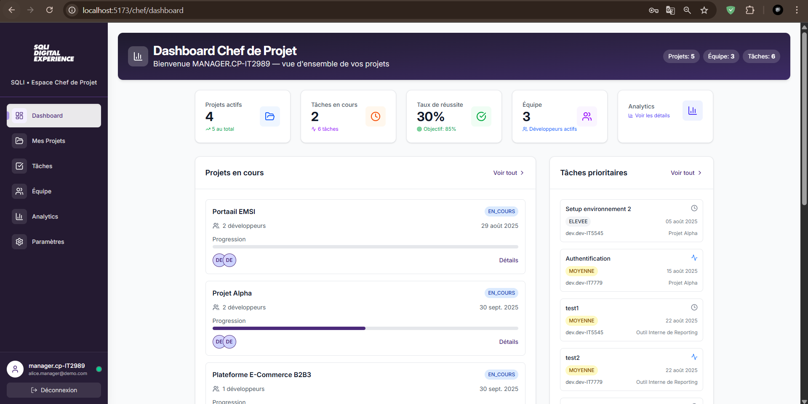

#### Gestion des Projets


#### Gestion des Tâches
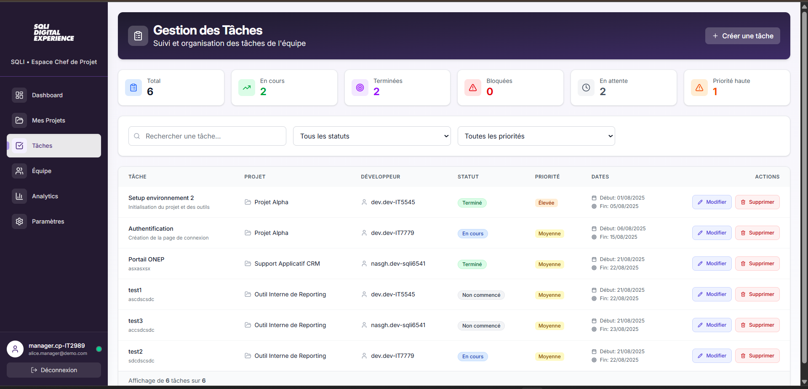

#### Gestion des Équipes
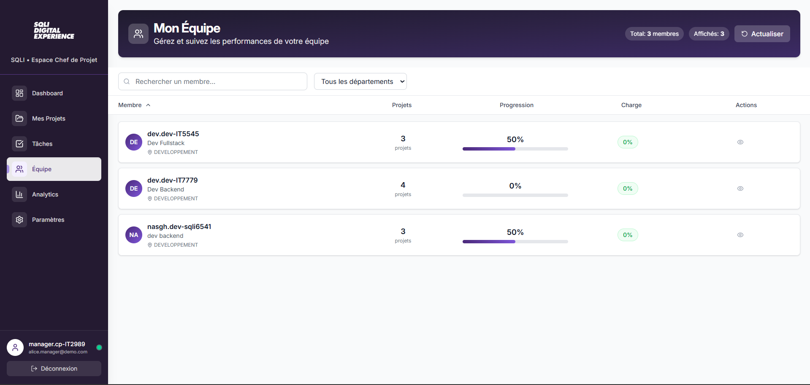

#### Analytics - État 1
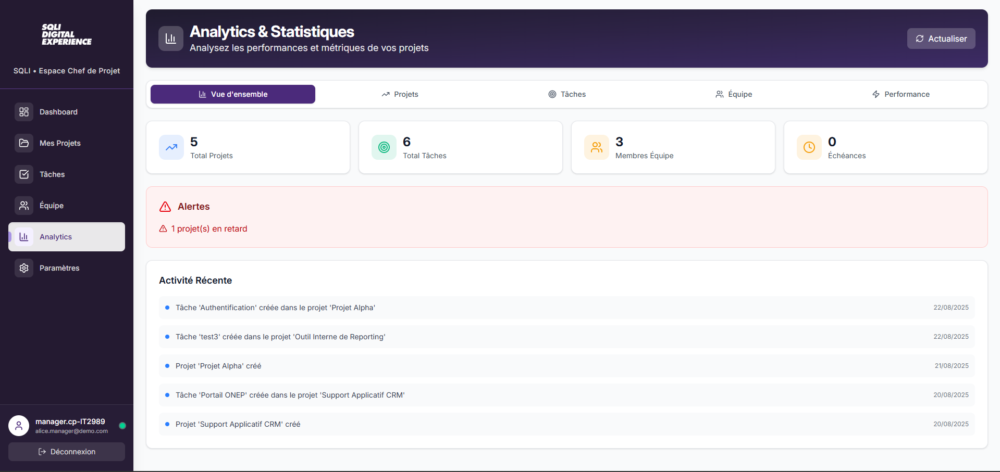

#### Analytics - État 2
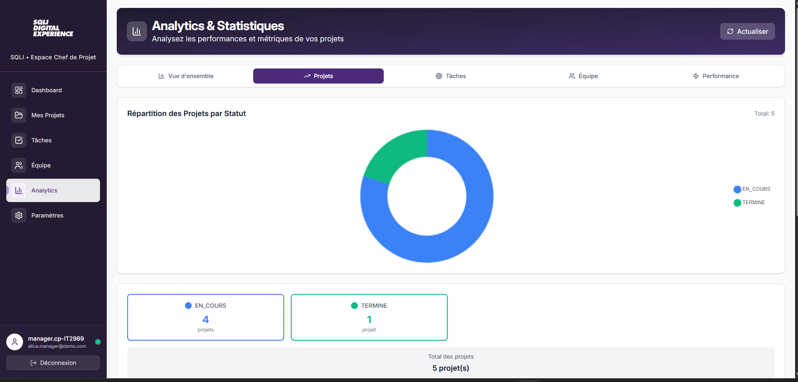

#### Analytics - État 3
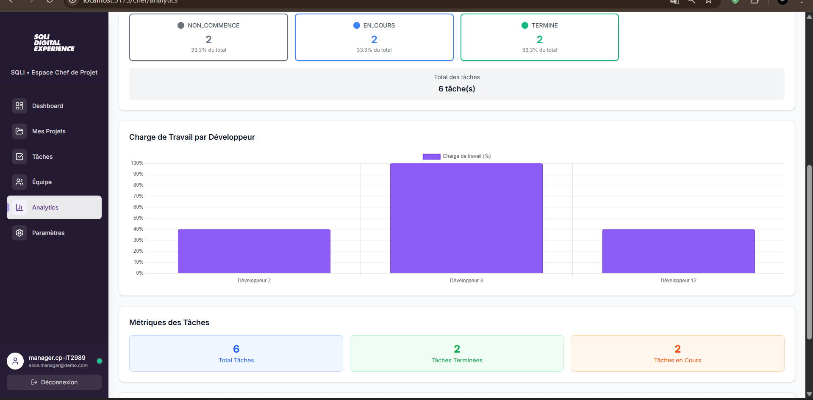

</div>

### 👨‍💼 Dashboard Développeur

<div align="center">

#### Vue d'ensemble
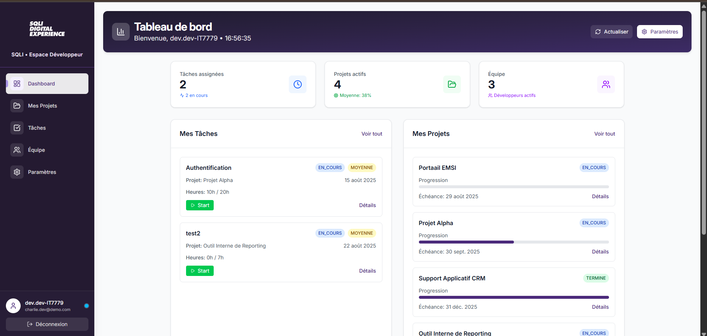

#### Gestion des Projets
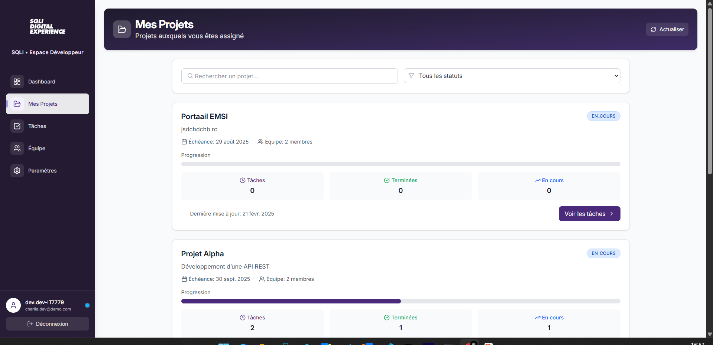

#### Gestion des Tâches
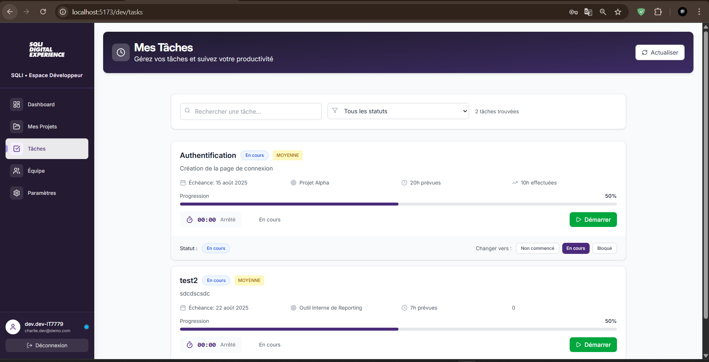

#### Gestion des Équipes
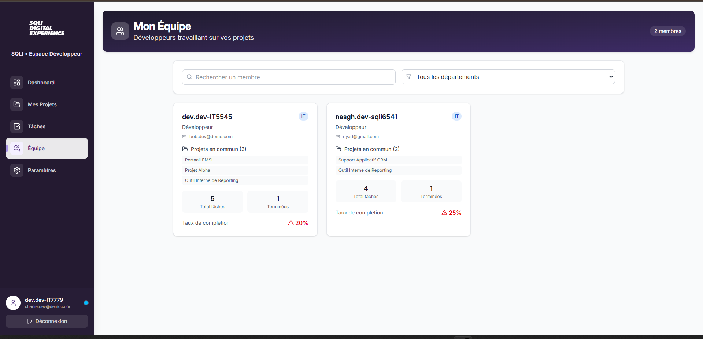

</div>

### 👤 Dashboard Client

<div align="center">

#### Vue d'ensemble
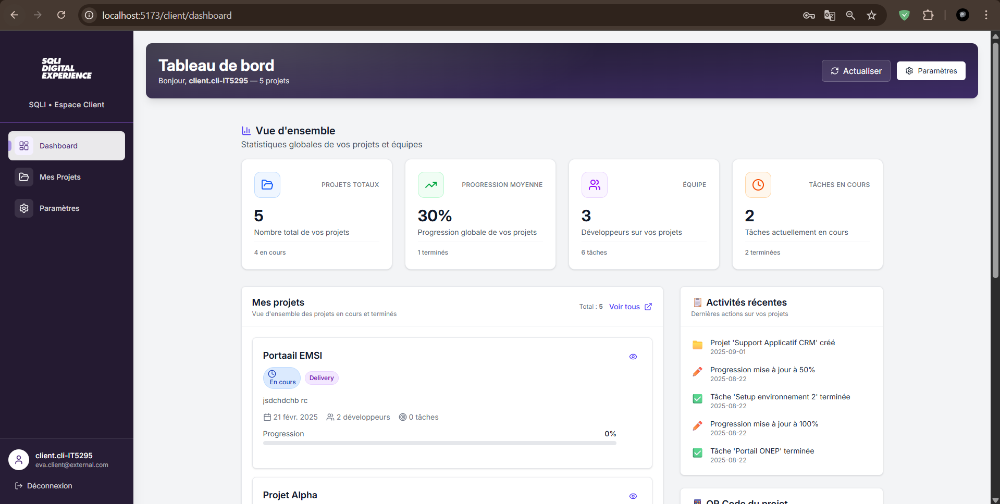

#### Liste des Projets
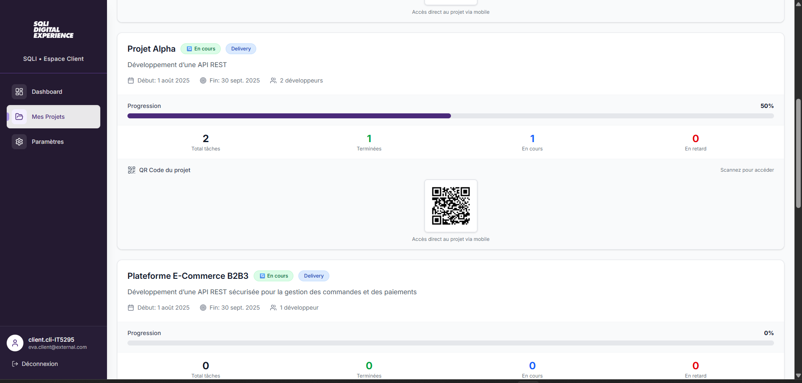

#### Accès QR Code Mobile
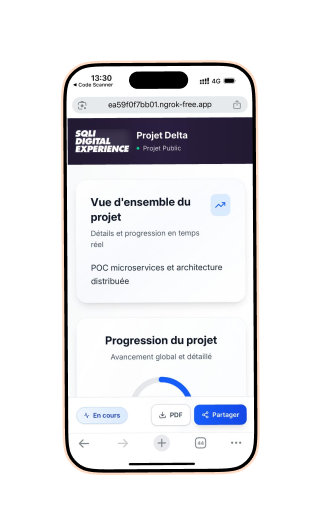

</div>

---

## 🏗️ Architecture

### 🎯 Stack Technologique

| **Frontend** | **Backend** | **Base de Données** | **Outils** |
|--------------|-------------|---------------------|------------|
| React 19.1.0 | Spring Boot 3.5.3 | PostgreSQL 12+ | Maven |
| TypeScript | Java 17 | JPA/Hibernate | Vite |
| Tailwind CSS | Spring Security | Liquibase | Git |
| Chart.js | JWT | | Docker |

### 📁 Structure du Projet

```
stage-sqli/
├── 📁 backend-sqli/                 # Application Spring Boot
│   ├── 📁 src/main/java/
│   │   ├── 📁 config/              # Configuration (Security, CORS, Swagger)
│   │   ├── 📁 controller/          # Contrôleurs REST API
│   │   ├── 📁 dto/                 # Data Transfer Objects
│   │   ├── 📁 entity/              # Entités JPA
│   │   ├── 📁 repository/          # Interfaces JpaRepository
│   │   ├── 📁 security/            # JWT, TokenBlacklist
│   │   ├── 📁 service/             # Logique métier
│   │   └── 📁 utils/               # Utilitaires (QR Code, etc.)
│   ├── 📁 resources/
│   │   ├── application.properties  # Configuration DB
│   │   └── templates/              # Templates HTML
│   └── pom.xml                     # Dépendances Maven
│
├── 📁 frontend-sqli/               # Application React
│   ├── 📁 app/
│   │   ├── 📁 components/          # Composants réutilisables
│   │   ├── 📁 routes/              # Pages de l'application
│   │   ├── 📁 services/            # Services API
│   │   └── 📁 types/               # Types TypeScript
│   ├── 📁 public/                  # Assets statiques
│   └── package.json                # Dépendances npm
│
└── 📁 Screen/                      # Captures d'écran
    ├── 📁 Admin/                   # Screenshots Admin
    ├── 📁 Auth/                    # Screenshots Auth
    ├── 📁 Chef/                    # Screenshots Chef
    ├── 📁 Dev/                     # Screenshots Dev
    └── 📁 Cli/                     # Screenshots Client
```

---

## ⚡ Fonctionnalités

### 🔐 Système d'Authentification
- ✅ **Connexion sécurisée** avec JWT Token
- ✅ **Gestion des rôles** (ADMIN, CHEF_DE_PROJET, DEVELOPPEUR, CLIENT)
- ✅ **Validation des mots de passe** forts
- ✅ **Génération automatique** de noms d'utilisateur uniques
- ✅ **Protection des routes** selon les permissions

### 👨‍💼 Dashboard Administrateur
- ✅ **Gestion complète des utilisateurs** (CRUD)
- ✅ **Attribution et gestion des rôles**
- ✅ **Activation/Désactivation** de comptes
- ✅ **Statistiques système** et monitoring
- ✅ **Historique des actions** et audit trail
- ✅ **Interface intuitive** avec tableaux de données

### 👨‍💻 Dashboard Chef de Projet
- ✅ **Gestion des projets** (création, modification, suppression)
- ✅ **Affectation des développeurs** aux projets
- ✅ **Suivi de la progression** en temps réel
- ✅ **Gestion des tâches** et priorités
- ✅ **Analytics avancées** avec graphiques interactifs
- ✅ **Timeline des projets** et activités récentes
- ✅ **Gestion des équipes** et ressources

### 👨‍💼 Dashboard Développeur
- ✅ **Vue des projets assignés** avec progression
- ✅ **Gestion des tâches** (démarrer, arrêter, terminer)
- ✅ **Timer intégré** pour le suivi du temps
- ✅ **Statuts des tâches** (NON_COMMENCE, EN_COURS, TERMINE)
- ✅ **Interface intuitive** pour la gestion quotidienne
- ✅ **Suivi de la charge de travail**

### 👤 Dashboard Client
- ✅ **Vue d'ensemble** des projets avec statistiques
- ✅ **Suivi en temps réel** de la progression
- ✅ **Timeline des projets** et activités
- ✅ **Détails complets** des projets et équipes
- ✅ **Interface professionnelle** et responsive
- ✅ **Accès aux informations** pertinentes

### 📊 Analytics et Rapports
- ✅ **Graphiques interactifs** (Chart.js)
- ✅ **Statistiques des projets** par statut et type
- ✅ **Analyse de la progression** des projets
- ✅ **Statistiques des tâches** par statut
- ✅ **Analyse de la charge de travail** des développeurs
- ✅ **Données en temps réel** avec fallback intelligent

### 🔒 Sécurité et Audit
- ✅ **JWT avec expiration** et blacklist
- ✅ **Validation des mots de passe** forts
- ✅ **Protection CSRF** et CORS configuré
- ✅ **Gestion des rôles** granulaire
- ✅ **Audit trail** complet
- ✅ **Traçage des actions sensibles**

---

## 🚀 Installation

### 📋 Prérequis

- **Java** : 17 ou supérieur
- **Node.js** : 18+ et npm
- **PostgreSQL** : 12+
- **Maven** : 3.6+
- **Git** : Pour cloner le projet

### 🔧 Installation Rapide

```bash
# 1. Cloner le projet
git clone https://github.com/Azzammoo10/stage-sqli.git
cd stage-sqli

# 2. Configuration de la base de données
# Créer une base PostgreSQL et configurer application.properties

# 3. Démarrer l'environnement complet avec le script PowerShell
.\start-dev.ps1

# OU démarrage manuel :
# 3a. Démarrer le backend
cd backend-sqli
./mvnw spring-boot:run

# 3b. Démarrer le frontend (nouveau terminal)
cd frontend-sqli
npm install
npm run dev
```

### 🚀 Démarrage Automatique avec start-dev.ps1

Le script `start-dev.ps1` automatise complètement le démarrage de l'environnement de développement :

#### 📋 Prérequis
- **PowerShell** : Version 5.1+ (inclus avec Windows 10/11)
- **ngrok** : Installé et configuré avec `ngrok.yml`
- **Java 17+** : Pour le backend Spring Boot
- **Node.js 18+** : Pour le frontend React
- **PostgreSQL** : Base de données configurée

#### 🎯 Fonctionnalités du Script
- ✅ **Démarrage automatique de ngrok** avec configuration
- ✅ **Détection automatique des tunnels** ngrok
- ✅ **Mise à jour automatique** des URLs dans les services
- ✅ **Démarrage séquentiel** du backend puis frontend
- ✅ **Gestion des ports** et des dépendances
- ✅ **Mise à jour des QR codes** avec les nouvelles URLs

#### 🔧 Utilisation

```powershell
# 1. Ouvrir PowerShell en tant qu'administrateur
# 2. Naviguer vers le répertoire du projet
cd C:\Users\AZZAM\Desktop\Projet_Stage_4IIR\stage-sqli

# 3. Exécuter le script
.\start-dev.ps1

# 4. Attendre que tous les services démarrent
# 5. L'application sera accessible sur :
#    - Frontend : http://localhost:5173
#    - Backend : http://localhost:8080
#    - ngrok : https://XXXX.ngrok-free.app
```

#### 📱 Mise à Jour Automatique des QR Codes

Le script met automatiquement à jour :
- `frontend-sqli/app/services/qrCodeService.ts`
- `backend-sqli/src/main/java/com/sqli/stage/backendsqli/service/QRCodeService.java`

Avec les nouvelles URLs ngrok pour permettre l'accès mobile via QR codes.

#### ⚠️ Résolution des Problèmes

**Erreur "ngrok n'est pas reconnu" :**
```powershell
# Ajouter ngrok au PATH ou utiliser le chemin complet
C:\Users\AZZAM\AppData\Local\ngrok\ngrok.exe start --all --config ngrok.yml
```

**Erreur de permissions PowerShell :**
```powershell
# Exécuter en tant qu'administrateur ou changer la politique
Set-ExecutionPolicy -ExecutionPolicy RemoteSigned -Scope CurrentUser
```

**Ports déjà utilisés :**
```powershell
# Vérifier les processus sur les ports
netstat -ano | findstr :8080
netstat -ano | findstr :5173
```

---

## 🔧 Configuration

### 🗄️ Base de Données

```properties
# application.properties
spring.datasource.url=jdbc:postgresql://localhost:5432/sqli_portal
spring.datasource.username=your_username
spring.datasource.password=your_password
spring.jpa.hibernate.ddl-auto=update
spring.jpa.show-sql=true
```

### 🔐 Configuration JWT

```properties
# application.properties
jwt.secret=your_jwt_secret_key_here
jwt.expiration=86400000
```

### 🌐 Configuration Frontend

```typescript
// services/api.ts
const API_BASE_URL = 'http://localhost:8080/api';
```

### 🌍 Configuration ngrok

Pour l'accès mobile et le partage de l'application :

#### 📁 Fichier ngrok.yml
```yaml
version: "2"
authtoken: "your_ngrok_auth_token"
tunnels:
  frontend:
    addr: 5173
    proto: http
  backend:
    addr: 8080
    proto: http
```

#### 🔑 Obtenir un Token ngrok
1. Créer un compte sur [ngrok.com](https://ngrok.com)
2. Récupérer le token d'authentification
3. Remplacer `your_ngrok_auth_token` dans `ngrok.yml`

#### 📱 Accès Mobile
- **QR Code automatique** : Le script `start-dev.ps1` met à jour automatiquement les URLs
- **Accès direct** : Utiliser l'URL ngrok générée
- **Partage** : Envoyer l'URL ngrok aux testeurs

---

## 📱 Scripts de Démarrage

### 🚀 start-dev.ps1 - Démarrage Automatique Complet

Le script `start-dev.ps1` est la solution recommandée pour démarrer l'environnement de développement complet.

#### 🎯 Avantages
- **Démarrage en un clic** de tous les services
- **Configuration automatique** des tunnels ngrok
- **Mise à jour automatique** des URLs dans le code
- **Gestion des dépendances** entre services
- **Interface utilisateur claire** avec statuts

#### 🔧 Utilisation Avancée

```powershell
# Vérifier que ngrok est installé
ngrok version

# Vérifier la configuration
Get-Content ngrok.yml

# Exécuter avec logs détaillés
.\start-dev.ps1 | Tee-Object -FilePath "startup.log"

# Arrêter tous les services
Get-Process -Name "java", "node", "ngrok" | Stop-Process -Force
```

#### 📊 Monitoring des Services

Le script affiche en temps réel :
- ✅ **ngrok** : Statut des tunnels et URLs générées
- ✅ **Backend** : Démarrage Spring Boot et base de données
- ✅ **Frontend** : Serveur de développement Vite
- ✅ **URLs** : Liens d'accès locaux et publics

#### 🚨 Dépannage Avancé

**Problème de ports :**
```powershell
# Libérer les ports utilisés
netstat -ano | findstr :8080
taskkill /PID <PID> /F

netstat -ano | findstr :5173
taskkill /PID <PID> /F
```

**Problème de base de données :**
```powershell
# Vérifier la connexion PostgreSQL
Test-NetConnection -ComputerName localhost -Port 5432

# Redémarrer le service PostgreSQL
Restart-Service postgresql-x64-15
```

**Problème de ngrok :**
```powershell
# Vérifier l'API ngrok
Invoke-RestMethod -Uri "http://localhost:4040/api/tunnels"

# Redémarrer ngrok manuellement
Stop-Process -Name "ngrok" -Force
Start-Process -FilePath "ngrok" -ArgumentList "start", "--all", "--config", "ngrok.yml"
```

---

## 📊 API Documentation

### 🔗 URLs d'accès

| **Service** | **URL** | **Description** |
|-------------|---------|-----------------|
| **Frontend** | http://localhost:5173 | Interface utilisateur |
| **Backend** | http://localhost:8080 | API REST |
| **Swagger UI** | http://localhost:8080/swagger-ui | Documentation API |

### 🔐 Authentification

```bash
# Login
POST /api/auth/login
{
  "username": "admin.sqli-0001",
  "password": "MotDePasse123!"
}

# Utilisation du token
Authorization: Bearer <jwt_token>
```

### 📋 Endpoints Principaux

| **Endpoint** | **Méthode** | **Description** |
|--------------|-------------|-----------------|
| `/api/auth/login` | POST | Connexion utilisateur |
| `/api/auth/logout` | POST | Déconnexion |
| `/api/users` | GET/POST | Gestion utilisateurs |
| `/api/projects` | GET/POST | Gestion projets |
| `/api/tasks` | GET/POST | Gestion tâches |
| `/api/analytics/*` | GET | Statistiques |

---

## 🤝 Contribution

### 📝 Standards de Code

- **Backend** : Java 17, Spring Boot, Maven
- **Frontend** : React 19, TypeScript, Tailwind CSS
- **Git** : Conventional Commits
- **Tests** : Coverage minimum 80%

### 🔄 Workflow de Contribution

1. **Fork** du projet
2. **Création** d'une branche feature
3. **Développement** et tests
4. **Pull Request** avec description détaillée
5. **Review** et merge


---

## 📞 Contact

### 👥 Équipe de Développement

| **Développeur** | **GitHub** | **Rôle** |
|-----------------|------------|----------|
| **Mohamed AZZAM** | [@Azzammoo10](https://github.com/Azzammoo10) | Full Stack Developer |


### 📧 Informations de Contact

- **GitHub** : [@Azzammoo10](https://github.com/Azzammoo10)
- **Email** : Via profils GitHub
- **LinkedIn** : À venir

### 🏢 Entreprise

- **SQLI Rabat** 
- **Type** : Projet de Fin d'Année (Stage)
- **Date** : Août 2025

---

## 📈 Métriques du Projet

### 📊 Statistiques

| **Métrique** | **Valeur** |
|--------------|------------|
| **Lignes de code Backend** | ~15,000 |
| **Lignes de code Frontend** | ~25,000 |
| **Total lignes de code** | ~40,000 |
| **Endpoints API** | 50+ |
| **Composants React** | 30+ |
| **Pages** | 20+ |
| **Rôles utilisateur** | 4 |

### 🎯 Qualité

- **TypeScript** : 100% typé
- **Responsive** : 100% mobile-friendly
- **Accessibilité** : Conforme WCAG 2.1
- **Performance** : Lighthouse Score 95+

---

## 🔖 Licence

### 📄 Informations de Licence

- **Type** : Projet académique (Projet de Fin d'Année)
- **Réutilisation** : Permise avec attribution
- **Commercial** : Non autorisé sans accord

### ✅ Utilisation Autorisée

- **Études** : ✅ Autorisé
- **Portfolio** : ✅ Autorisé avec attribution
- **Commercial** : ❌ Non autorisé
- **Modification** : ✅ Autorisé avec attribution

---

<div align="center">

**🚀 Projet développé avec passion pour SQLI Rabat**

*Dernière mise à jour : Août 2025 | Version : 1.0.0 | Statut : Production Ready*

</div>


